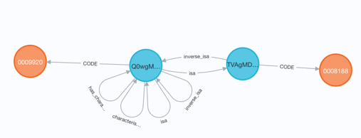

# Adding assertion data from an ontology to the Unified Biomedical Knowledge Graph
---

# Objectives
This guide describes how to format a set assertions so that it can be added to the Unified Biomedical Knowledge Graph database. 
 
The guide includes recommendations for optimizing and deepening the integration of a set of assertions into the UBKG 
to establish new relationships among entities and cross-references among ontologies.

# Audience
This guide is intended for users who are subject matter experts in what biomedical assertions they might want to represent (e.g., genes and their products), as an ontology, but not necessarily conversant with either ontological concepts or knowledge graphs.

# Glossary
The [glossary](/glossary) describes terms that this guide uses that are relevant to ontologies or knowledge graphs. 

# Guiding Principles for Integration
An important goal of the UBKG is to establish connections between ontologies. For example, if information on the relationships between proteins and genes described in one ontology can be connected to information on the relationships between genes and diseases described in another ontology, it may be possible to identify previously unknown relationships between proteins and diseases.

If the UBKG is to connect ontologies, the ontologies should, as much as possible, represent their entities and relationships similarly. 

**_To the degree possible_**,
1. Entities should be _encoded_ with codes from published biomedical ontologies and vocabularies. For example, genes should be encoded in a standard vocabulary such as HGNC.
2. Relationships should be represented with properties from the [Relations Ontology](https://www.ebi.ac.uk/ols/ontologies/ro).
3. Codes for entities should be _cross-referenced_ to UMLS CUIs (via the **node_dbxrefs** column, described below).

# Integration Options
A set of assertions can be integrated into the UBKG from sources that include:
1. An OWL file that follows OBO principles. If the OWL file is published online, only the URL to the OWL is needed.
2. A set of _ingest files_ in _UBKG edge/node format_.
3. Other data sources, via custom scripts

This guide focuses on the format of UBKG ingest files.

# Ingest Files in UBKG Edge/Node Format
A set of UBKG ingest files describes the entities and relationships of a set of assertions that is to be integrated into the UBKG. 

An ingest file set consists of two Tab-Separated Variables (TSV) files:

- **edges.tsv**: Describes the triples comprising the ontology
- **nodes.tsv**: Describes metadata for entities

## Source Abbreviations (SABs) 
The UBKG identifies a set of assertions by means of a _Source Abbreviation_ (SAB). SABs often correspond to abbreviations for ontologies (e.g., PATO) or vocabularies (e.g., ICD-10). 

For new sets of assertions, define a preferred SAB to represent the initiative, project, or institution.

SABs are uppercase in the UBKG. 

## edges.tsv
The edges file lists the _triples_ (subject node - predicate - object node) that constitute a set of assertions.

###  Fields

| Field                       | Corresponding element in UBKG | Accepted formats                                                                                            | Examples                                        |
|-----------------------------|-------------------------------|-------------------------------------------------------------------------------------------------------------|-------------------------------------------------|
| subject                     | **Code** node                 | IRI for a concept in a published ontology                                                                   | http://purl.obolibrary.org/obo/UBERON_0004086   |
|                             |                               | Code for the concept in the format _SAB_ {space} _code in ontology_                                         | UBERON 0004086                                  |
| predicate                   | relationships                 | For hierarchical relationships, the IRI http://www.w3.org/2000/01/rdf-schema#subClassOf OR the string “isa” | http://www.w3.org/2000/01/rdf-schema#subClassOf |
|                             |                               | For non-hierarchical relationships, an IRI for a relationship property in RO	                               | http://purl.obolibrary.org/obo/RO_0002292       |
|                             |                               | Custom string                                                                                               | drinks milkshake of                             |
| object                      | **Code** node                 | same as for subject                                                                                         |                                                 |
| evidence_class (_optional_) | **string**                    | Statement specific to an SAB to classify evidence                                                           | -0.016084092                                    |

###  Recommendations for nodes
 
Many nodes will correspond to entities that have already been identified in a standard biomedical ontology; for these, the IRI is preferred. 
For entities that have not been encoded in an ontology, a suitable identifier is sufficient.

For example, the UBKG includes information relating genes and gene products obtained from UniProtKB. Proteins are identified using their UniProtKB Entry ID, instead of an IRI.

###  Recommendations for edges
The preferred source of relationship (predicate) information is the Relations Ontology (RO). Reasons for this include:
1. RO is a general reference for relationships, and is therefore likely already to have a standard relationship defined that is suitable.
2. RO defines inverse relationships, especially those that may not be obvious.

It is possible, nevertheless, that RO does not contain a relationship that is specific enough for an assertion, so a custom relationship will be needed. When defining a custom relationship, we recommend that the label be short and consise. (We realize that this is easier said than done. Defining consise relationships is the hard part of modelling assertions.)

## nodes.tsv
 The nodes.tsv file provides metadata on entities.

### Fields

| Field                        | Corresponding element in UBKG                                          | Accepted formats                                                                                                              | Examples                                                    |
|------------------------------|------------------------------------------------------------------------|-------------------------------------------------------------------------------------------------------------------------------|-------------------------------------------------------------|
| node_id                      | **Code** node                                                          | IRI for a concept in a published ontology                                                                                     | http://purl.obolibrary.org/obo/UBERON_0004086               |
|                              |                                                                        | Code for the concept in the format _SAB_ {space} _code in ontology_                                                           | UBERON 0004086                                              |
| node_label                   | **Term** node, _Preferred Term_ (PT) relationship                      | Text string                                                                                                                   | Ventricles of hindbrain                                     |
| node_definition (_optional_) | **Definition** node, _DEF_ relationship                                | Text string                                                                                                                   | One of the system of communicating cavities in the brain …. |
| node_synonyms (_optional_)   | **Term** node; _Synonym_ (SYN) relationship                            | **Pipe-delimited** list of synonyms                                                                                           | Example for synonyms                                        |
| node_dbxrefs (_optional_)    | Cross-references                                                       | Pipe-delimited list of references to cross-referenced concepts. Each cross-reference should be in format SAB:code or UMLS:CUI | Example for dbxrefs                                         |
| value (_optional_)           | Numeric value                                                          | 20                                                                                                                            |                                                             |
| lowerbound (_optional_)      | Lower bound of range for values                                        | 5                                                                                                                             |                                                             |
| upperbound (_optional_)      | Upper bound of range for values                                        | 100                                                                                                                           |                                                             |
| unit (_optional_)            | Unit of measure for value. This is currently not encoded to a concept. | mm                                                                                                                            |                                                             |

#### Example for synonyms: 
region of ventricular system of brain|brain ventricles|cerebral ventricle
#### Example for dbxrefs:
umls:c0007799|fma:78447

The UMLS cross-reference in the example is to a CUI; the fma cross-reference is to a code.

# Requirements (business rules) for nodes and relationships
1. A node identified in edges.tsv must satisfy **at least one** of the following criteria:
- It is defined in nodes.tsv.
- It already exists in the UBKG.

The UBKG generation framework will ignore nodes that do not satisfy at least one of these criteria.

2. If a triple in edges.tsv refers to a node from a non-UMLS ontology, the non-UMLS ontology will need to be ingested into the UBKG first. For example, because the Mammalian Phenotype Ontology (MP) includes nodes from the Cell Ontology (CL), CL should be integrated into the UBKG before MP. This often improves the cross-referencing because the general ontologies have deeper external-referencing to UMLS and other OBO sources.
3. [This spreadsheet](https://github.com/dbmi-pitt/UBKG/blob/main/user%20guide/ontology%20neo4j%20SABs%20and%20sample%20codes%20-%20ontology%20neo4j%20SABs%20and%20sample%20codes.csv) lists the SABs and example codes for the ontologies that are currently represented in the UBKG. It should be used as the reference for formatting existing source abbreviations (SAB) and their codes. In other words, if a SAB is already part of the UBKG, it should be sufficient to refer to the node by code. 

For additional details regarding the UMLS SABs, please consult [the UMLS reference](https://www.nlm.nih.gov/research/umls/sourcereleasedocs/index.html).

4. Some ontologies (including HGNC, GO, and HPC) include the SAB in codes (e.g., HGNC:9999) Nodes for concepts from these ontologies should be formatted as <SAB><space><SAB>: code-e.g., “HGNC HGNC:9999”.
5. The UBKG ingestion will reformat predicates so that strings are delimited with underscores.
6. The UBKG ultimately requires that two nodes be linked with both a relationship and its inverse. However, in an edges file each relationship (predicate) should be represented only once (NOT with the original and inverse). The UBKG identifies and adds the inverse relationships using the RO as follows:

| predicate                                                                | form of inverse relationship                 | comment                                                                                                                                   |
|--------------------------------------------------------------------------|----------------------------------------------|-------------------------------------------------------------------------------------------------------------------------------------------|
| IRI of relationship property in RO                                       | Resolution via RO, using the IRI             |                                                                                                                                           |
| String that corresponds to the relation label (e.g., “has gene product”) | Resolution via RO, using relationship labels | not as precise as IRI                                                                                                                     |
| Custom string                                                            | Appends “inverse_” to the string             | If the custom string actually corresponds to a relationship in RO with an ambiguous inverse, UBKG will create a new inverse relationship. |
| IRI of relationship property from ontology other than RO                 | none                                         | The UBKG will ignore these relationships.                                                                                                 |

# Best Practices for cross-references 
The items in the **_node_dbxref_** field of **nodes.tsv** establish cross-references. The degree to which an ontology integrates with the UBKG depends directly on cross-references: an ontology with nodes that cross-reference nodes in other ontologies are more likely to contribute to new relationships, while an ontology with few cross-references will essentially exist independently of the rest of the UBKG.

A good rule of thumb for cross-references is: _the closer to a UMLS CUI, the better_.

The UBKG ingestion preferentially selects UMLS CUIs from the list in node_dbxref. 
It is not necessary to list both a UMLS CUI and a code from an ontology that is already in the UMLS. 
If it is not feasible to cross-reference a UMLS CUI, then try to cross-reference a code from a published, OBO-compliant ontology.

# Cross-references vs. isa

A cross-reference (**dbxref**) is not the same thing as an **isa** relationship. 

## isa
An **isa** assertion between two nodes indicates that the subject node relates to the object node hierarchically.

For example, the Mammalian Physiology Ontology (MP) asserts that
MP:0009920 (abnormal t2 stage b cell morphology) **isa** MP:0008188 (abnormal transitional stage B cell morphology).

In the UBKG, the Code node for MP:0009920 has a path to the Code node for MP:0008188 through 
concepts that link via an isa relationship. Each Code node (orange) associates with a separate Concept node (blue).
In other words, the UBKG considers the two Codes to represent different concepts.

MP also cross-references MP 0009920 to CL:0000959 (T2 B cell).

In the UBKG, the Code nodes share the same Concept node. The two Code nodes represent the same Concept.

It is not necessary to link two concepts with both an *isa* relationship in the edge file and a *node_dbxref* in the node file.

Another way to think of this is:
- **isa** means "is a type of"
- **dbxref** means "is the same as"