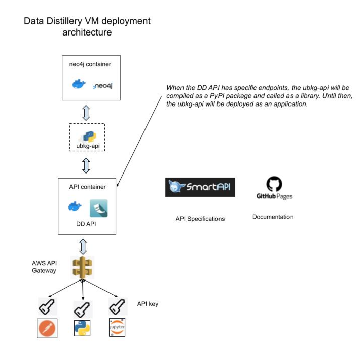
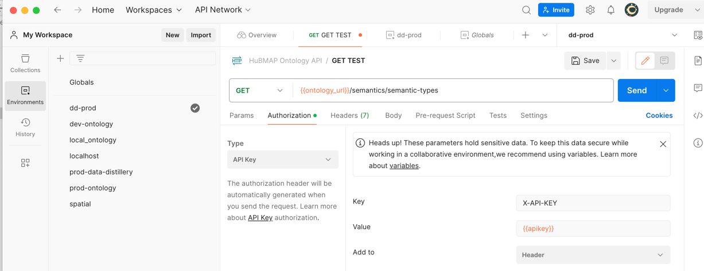

# Unified Biomedical Knowledge Graph (UBKG) 
# REST APIs

There are multiple implementations of REST APIs that connect to and abstract instances of the 
the UBKG. Pitt DBMI maintains the following:

# ubkg-api
The **ubkg-api** provides a core set of generic endpoints that return information that is common to all deployments of 
the UBKG, such as relationships between Codes and Concepts.

The SmartAPI description for this API can be found [here](https://smart-api.info/ui/96e5b5c0b0efeef5b93ea98ac2794837).

_Note: this specification currently describes the implementation of the **ubkg-api** that supports UBKG in 
neo4j version 4. The **ubkg-api** is currently being upgraded to support version 5 of neo4j._

# "Child" API deployments
The ubkg-api can be deployed either directly as a service or as a library, to be used by another 
API service. The library architecture allows for the separation of functionality between the ubkg-api's core set
of endpoints and endpoints in a "child API" that are specific to a particular UBKG deployment.

When used as a library, the **ubkg-api** is compiled as a PyPI package.
A child API exposes both the generic endpoints of the **ubkg-api** and endpoints specific to the deployment.

## Data Distillery API
The Data Distillery API adds endpoints that are specific to the Data Distillery implementation of UBKG.
The specification for the Data Distillery API is [here](https://smart-api.info/ui/55be2831c69b17f6bc975ddb58cabb5e).

__Note: As of March 2024, there are no endpoints specific to Data Distillery, so the Data Distillery API is identical to the ubkg-api.__

The following diagram illustrates the cloud-based application architecture of the Data Distillery deployment. 
The API server and neo4j instance run in Docker containers behind an AWS API Gateway. Access to the API is controlled by 
means of an API key.



## hs-ontology-api
The **hs-ontology-api** adds endpoints that are specific to the HuBMAP and SenNet implementation of UBKG.
The SmartAPI specification for hs-ontology-api is [here](https://smart-api.info/ui/d10ff85265d8b749fbe3ad7b51d0bf0a).

_Note: this specification currently describes the implementation of the **hs-ontology-api** that supports UBKG in 
neo4j version 4. The **hs-ontology-api** is currently being upgraded to support version 5 of neo4j._

# Calling the APIs
All of the UBKG APIs are REST APIs that return JSON objects. The SmartAPI specifications describe 
- endpoints
- request parameters
- responses
- errors

# Use of API keys in the Data Distillery API

## Obtaining API keys
Obtain an API key for the Data Distillery by contacting the UBKG Steward:

 [Jonathan Silverstein, MD](mailto:j.c.s@pitt.edu)

      
    Jonathan Silverstein, MD
    Department of Biomedical Informatics
    University of Pittsburgh

**Keep your API key private. In particular, do not publish your key in public repositories, such as 
GitHub.**

## Using the API key
The API key will need to be part of a GET Request header with key **X-API-KEY**.

### Postman
In your Postman Workspace, create an Authorization Header with properties:
- Type: API Key
- Key: X-API-KEY
- value: your api key (ideally, stored in a variable)
- Add To: Header



### Python and Jupyter Notebook

Add the api key to the header of your request.

The following simple script (in Python 3.10) uses the _requests_ package to 
execute queries against the Data Distillery API.

```
# coding: utf-8

# Simple Python script that demonstrates how to use the API key stored in a file named api.key
# in the application directory to execute an endpoint.

import requests
import os

# Read the API key.
fpath = os.path.dirname(os.getcwd())
fpath = os.path.join(fpath, 'tests', 'api.key')
f = open(fpath, 'r')
apikey = f.read()
f.close()

# Add the API key to authorization for the URL.
headers = {'X-API-KEY': f'{apikey}'}

# Execute the endpoint.

# Compile demonstration scenarios into a list of tuples.

scenarios = []
scenario1='Misspelled base url (distilleryz instead of distillery), which will result in a ConnectionError.'
url1 = 'https://datadistilleryz.api.sennetconsortium.org/concepts/C2720507/paths/shortestpath/C1272753?sab=SNOMEDCT_US&rel=isa'
scenarios.append((scenario1,url1))

scenario2 = 'Nonexistent endpoint part of url (conceptsz instead of concepts), which will result in a 403 (Forbidden) from the gateway.'
url2 = 'https://datadistillery.api.sennetconsortium.org/conceptsz/C2720507/paths/shortestpath/C1272753?sab=SNOMEDCT_US&rel=isa'
scenarios.append((scenario2,url2))

scenario3 = 'Error in query parameter name (sabz instead of sab), which will result in a 400 error.'
url3 = 'https://datadistillery.api.sennetconsortium.org/concepts/C2720507/paths/shortestpath/C1272753?sabz=SNOMEDCT_US&rel=isa'
scenarios.append((scenario3,url3))

scenario4 = 'Long query that should exceed the API timeout.'
url4='https://datadistillery.api.sennetconsortium.org/concepts/C2720507/paths/expand?sab=SNOMEDCT_US&rel=isa&mindepth=9&maxdepth=10&skip=1&limit=10'
scenarios.append((scenario4,url4))

scenario5 = 'Valid request'
url5 = 'https://datadistillery.api.sennetconsortium.org/concepts/C2720507/paths/shortestpath/C1272753?sab=SNOMEDCT_US&rel=isa'
scenarios.append((scenario5,url5))

for scenario in scenarios:
    print('')
    print('----------------')
    print(f'SCENARIO {scenarios.index(scenario)+1}: {scenario[0]}')
    url = scenario[1]
    try:
        response = requests.get(url,headers=headers)

        if response.status_code == 403:
            # The API gateway does not recognize the endpoint path--i.e., this is the gateway's translation of a 404.
            print(f'HTTP 403 error (forbidden). This endpoint does not exist: {response.request.path_url.split("?")[0]}')
            print('Check spelling of endpoint path string.')
            pass
        elif response.status_code == 404:
            # This could be the result of a timeboxed query that exceeded the DD-API's timeout.
            print(f'HTTP 404 error (not found) for URl: {url}')
            print('Note that the Data Distillery API returns 404 for queries that exceed the specified timeout.')
            pass
        elif response.status_code != 200:
            response.raise_for_status()
        else:
            print()
            print(f'RESPONSE for url: {url}')
            respjson = response.json()
            print(respjson)

    except requests.ConnectionError:
        # Unable to connect. This is likely because of an error in the base url.
        print(f'Unable to connect with url: {url}')
        print(f'Check spelling of base url {url[0:url.find(".org/")+4] }')
        pass
    except requests.HTTPError as err:
        print(err)
        pass
    except Exception as err:
        print(f"Unexpected {err=}, {type(err)=}")
        pass


```