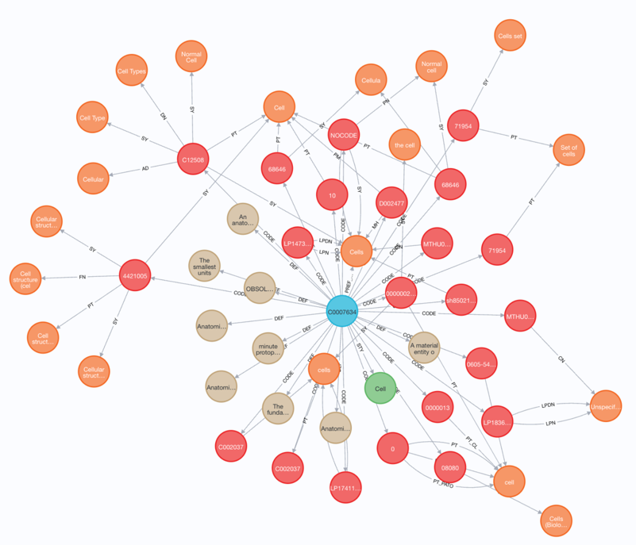

# Unified Biomedical Knowledge Graph (UBKG) 
## UBKG API Guide

This guide supplements the [SmartAPI](https://smart-api.info/ui/96e5b5c0b0efeef5b93ea98ac2794837#/) documentation page on the ubkg-api. 

The SmartAPI page describes the format of requests to and responses from the UBKG APIi and allows one to execute test queries directly against a UBKG instance.

# Background
## Purpose
The UBKG API is a set of RESTful GET endpoints that return translated
information from an instance of the UBKG. 
The UBKG API allows querying of a UBKG without 
+ Cypher (the query language of neo4j, the graph database platform for the UBKG)
+ a neo4j browser
+ extensive knowledge of the UBKG data model.

## Scope
The UBKG API endpoints are generic and work with the fundamental structures of the UBKG.  Endpoints are parameterized and do not assume a particular UBKG context (or content imported from a set of data sources). 

The scope of the UBKG API is focused on
+ the elements of [concept subgraphs](https://ubkg.docs.xconsortia.org/datamodel/#the-concept-subgraph)–i.e., how concepts are encoded in the data sources that comprise a UBKG context
+ _paths_–the sets of directed series of relationships between concepts that begin with an originating concept. Path information includes _shortest paths_ and _spanning trees_.

## Child UBKG API instances
It is possible for a UBKG instance to support specific use cases. 
For example, instances of the HuBMAP/SenNet UBKG context contain data 
from specific ontologies that result in complex paths.

Endpoints that work only with data from a specific context can be provided 
in a _child API_ instance. A child API is an API instance that can 
support both the generic endpoints of the UBKG API and specific 
endpoints specific to the child API. 
A child API imports the UBKG API that has been compiled as a library 
(technically, a PyPI package). 
A child API is thus similar to a subclass of the UBKG API.

Current child UBKG API instances include:
+ [hs-ontology-api](https://smart-api.info/ui/d10ff85265d8b749fbe3ad7b51d0bf0a), which contains endpoints specific to the HuBMAP/SenNet UBKG context
+ [Data Distillery API](https://smart-api.info/ui/1f1cf8d6228a323a2c37c5834216eb6e), which supports the Data Distillery UBKG context.

## API authentication
Some deployments of the UBKG API require that the consuming 
application be authenticated. Authentication usually involves the 
use of keys that are passed in the headers of API requests. 
For example, the Data Distillery API, a child UBKG API that supports 
the public instance of the Data Distillery, requires that the 
consumer present an API key from a UMLS license account.

Authentication occurs outside the UBKG API and will be specific to 
the server environment that hosts the API. 

# Endpoint URL conventions
UBKG API endpoints are exclusively GET: they return formatted results of Cypher queries executed against a UBKG database. 
The URLs used to execute the endpoints of the UBKG API are extensively parameterized and 
conform to the following conventions:
+ _URL path parameters_ are used for required filters. URL path parameters are represented in SmartAPI in format {id}. For example, in the /codes/{code_id}/codes endpoint, {code_id} represents a required URL path parameter string that filters the response to that for a particular code.
+ Query parameters are used for optional filtering. A set of query parameters comprises key-value pairs
  + separated by the equals sign
  + following the question mark prefix
  + delimited with the ampersand 
# Query parameter options for sab and rel
Both _sab_ and _rel_ parameters accept multiple values. For example
+ The sab parameter can specify both SNOMEDCT_US and UBERON.
+ The rel parameter can specify both _isa_ and _part_of_.

Multiple values of a parameter can be specified in two ways:
+ as a comma-delimited list–e.g., ?sab=SAB1,SAB2,SAB3
+ as a series of single key-value pairs–e.g., ?sab=SAB1&sab=SAB2&sab=SAB3

# Visualizations
UBKG API responses are in JSON format. 
This guide represents the responses of endpoints visually by means of annotated screen 
captures from a neo4j browser in which the Cypher queries behind 
endpoints were executed.

In the visualizations that follow:
+ **Concept** nodes are blue
+ **Code** nodes are red
+ **Term** nodes are orange
+ **Definition** nodes are tan
+ **Semantic** nodes are green

# Concept subgraph endpoints
As described in the [UBKG data model](https://ubkg.docs.xconsortia.org/datamodel/#data-model), the UBKG is based on concept nodes and code synonymy. 
If a code in one data source encodes the same concept as a code in another data source, the two codes are _synonymous_; 
the UBKG links both codes to the shared concept.

Every concept in the UBKG is the origin of a _[concept subgraph](https://ubkg.docs.xconsortia.org/datamodel/#the-concept-subgraph)_: a set of 
relationships between a node that represents the concept and nodes that represent metadata for the concept–i.e., 
the codes, terms, definitions, and semantic types that associate with the concept.

Concept subgraph endpoints allow for translation of concept metadata.
## /codes/{code_id}/codes
Returns the set of codes that are synonyms of the code with the specified CodeId 
property–i.e., the codes that share the concept with which the code is associated.

The example in SmartAPI executes the endpoint with {code_id}=**SNOMEDCT_US:254837009**. 
This returns all of the codes that are synonyms in the UBKG–i.e., that share an association 
with the concept with CUI C0006142. The visualization of the query is below, 
with the code for **SNOMEDCT_US:254837009** circled in green.


## /codes/{code_id}/concepts
Returns the set of concepts with which the code with the specified 
CodeID associates.

Although most codes in the UBKG associate with one concept, a number 
associate with multiple concepts. The example in SmartAPI executes 
the endpoint for the code **SNOMEDCT_US:79962008**, which associates 
with five concepts. 

## /concepts/{concept_id}/codes
Returns the set of codes that associate with a concept with the specified CUI–i.e., 
the synonymous codes of the concept’s concept subgraph.

The SmartAPI example executes the endpoint for the concept with CUI 
C067822. The following visualization shows the response of the endpoint query without optional filtering.


## /concepts/{concept_id}/definition
Returns the set of definitions that associate with the concept with 
the specified CUI–i.e., the definitions in the concept’s 
concept subgraph.

The SmartAPI example executes the endpoint for CUI **C0006142**. 
This concept has definitions from three data sources 
(DOID; NCI; and MEDLINEPLUS). Although data sources assign 
definitions to codes, the UBKG associates definitions with the 
associated concepts.


## /concepts/{concept_id}/nodeobjects
The **nodeobjects** endpoint returns information on the concept 
subgraphs (also referred to as nodeobjects) that match the specified 
value of {concept_id}. Each element of the nodeobjects array in the 
response is a concept subgraph. Each concept subgraph contains arrays of objects 
that represent:
+ the codes that associate with the concept
+ the definitions for the concept
+ the semantic types for the concept

The concept_id parameter is a string that can be used to identify 
concept subgraphs in terms of the following:
+ a CUI
+ the preferred term for a Concept
+ the CodeID for a Code linked to the Concept
+ a term for a Code linked to a Concept

Values of concept_id can result in responses that include multiple 
concept subgraphs. String matches on terms are fuzzy to a 
degree–e.g., searching on a preferred term of “Malignant 
neoplasm of breast” also finds “Malignant neoplasm of skin of breast”.

### Examples

+ /concepts/Cells/nodeobjects returns the single concept subgraph for the concept with preferred term “Cells”. The same concept subgraph would be returned if concept_id were 
  + “Cellula” - a term for codes associated with the concept
  + “NCI:C12508” - the CodeId for one of the codes associated with the concept
  + C0007634 - the CUI

+ /concepts/Heart/nodeobjects returns multiple concept graphs, due to the generality of the term “Heart”.


## /terms/{term_id}/codes
Returns the set of codes with terms that exactly match term_id.

The SmartAPI example returns the codes that match the term 
“Breast Cancer”.


## /terms/{term_id}/concepts
Returns the set of concepts that associate with the codes having 
terms that exactly match term_id.
The SmartAPI example returns the concepts associated with the 
term “Breast Cancer”.


# Concept assertion path endpoints
As described in the [data model](https://ubkg.docs.xconsortia.org/datamodel/#assertion-concept-concept-relationship-model), the 
UBKG represents the predicates of assertions from data sources as 
relationships between Concept nodes. 
A set of Concept nodes can be linked by assertion relationships in a topological ordering, 
or _path_. 

Important types of path in the UBKG include:
+ _taxonomies_, in which concepts are linked with **_isa/inverse_isa_** bidirectional pairs of assertion relationships
+ _partonomies_, in which concepts are linked with assertion pairs such as **_part_of/has_part_**

## APOC
The assertion path endpoints execute Cypher queries that feature APOC procedures.

## Path filtering
The UBKG supports _polyhierarchy_, in which a concept can be a member of 
multiple paths from different data sources. In addition, a path 
can include many “hops” at increasing topological distance from an 
origin (also known as path depth).  

Polyhierarchy and path depth mean that queries that return 
path information can be large and require intensive processing. 

For example, the following visualization illustrates a subset of the paths that 
originate from the concept with CUI **C2720507** (the root concept 
of the SNOMEDCT_US vocabulary in the UMLS, identified with the 
green circle). 
The image shows only the first 40 paths that are involved in 
“SNOMEDCT_US isa” paths of with depths less than 3–i.e., 
only the first 40 paths that are within 3 hops of the origin, 
in which the hops are defined by isa relationships with 
SAB=SNOMEDCT_US.


Because of the large number of paths that may originate from a 
concept, path-related endpoint queries can either exceed the 
server timeout (currently 28 s) or the size of the response 
payload (currently 10 MB). To keep responses within 
timeout and payload limits, the proper selection of filter values 
is important.

### sab
The _sab_ filter limits searches to assertions from one or more data sources–e.g., SNOMEDCT_US.
### rel
The _rel_ filter limits searches to assertions with one or more labels–e.g., isa.
### mindepth, maxdepth
These filters specify the minimum and maximum number of hops from the origin for which to return path information. For example, a path query could return information on concepts that are between 3 and 5 hops. Large depth filters (e.g., 8) are likely to result in timeout. The default values for mindepth and maxdepth are 0 and 2. The mindepth cannot exceed the maxdepth.
### limit, skip
These filters allow the return of a “window” of information from paths–e.g., limit = 10 and skip = 20 would result in the subset of paths ranging from the tenth to the 30th. Because neo4j’s path searching uses Depth First Search, results of path-related queries are always in the same order.

## Response format
The responses from path-related endpoints are JSONs with a schema that corresponds to the Table result frame of the endpoint query in the neo4j browser. The intent of this formatting is to provide sufficient information for export of query results.

## /concepts/{concept_id}/paths/expand
Returns the set of paths that originate from the concept with 
CUI=_concept_id_, subject to filtering constraints (sab, rel, mindepth, maxdepth, limit, skip). 

The endpoint executes a Cypher query that employs the **apoc.path.expand** routine.

The preceding visualization illustrates the response of the expand endpoint for CUI **C2720507** 
with sab=SNOMEDCT_US, rel=isa, mindepth=2, maxdepth=3, limit=40, skip=0.

## /concepts/{concept_id}/paths/trees
Returns paths in the _spanning tree_ that originates from the 
concept with CUI=_concept_id_, subject to filtering constraints 
(sab, rel, mindepth, maxdepth, limit, skip). 

A [spanning tree](https://en.wikipedia.org/wiki/Spanning_tree#:~:text=In%20the%20mathematical%20field%20of,see%20about%20spanning%20forests%20below).) of a graph is a subgraph 
that is a tree (a subgraph in which each node has exactly one edge with another node) that 
includes all the nodes of the graph. 

The endpoint executes a Cypher query that employs the **apoc.path.spanningtree** routine.

Many of the assertion paths in the UBKG result in directed acyclic graphs–e.g., those of SNOMEDCT_US. 
Spanning trees of the resulting graphs are likely to be very similar to straightforward path expansions.

## /concepts/paths/subgraph
Returns a subgraph of the UBKG of concept nodes that are linked by specified 
assertion relations, subject to filtering parameters. 
The subgraph in this case is a simple set of concepts related by assertion relationships.

The SmartAPI example returns the first 10 pairs of concepts that are associated with the SNOMEDCT_US _isa_ relationship.


## /concepts/paths/subgraph/sequential
## /concepts/{concept_id}/paths/subgraph/sequential

Returns the set of paths with a sequence of relationships that match a specified pattern,
subject to filtering constraints (limit, skip). 
If a concept_id is provided in the path, the set of paths is filtered to those that originate from the
concept with CUI _concept_id_ with the sequence of relationships that match the specified pattern.

The endpoint executes a Cypher query that employs the **apoc.path.expandConfig** routine.

### relsequence
The _relsequence_ parameter specifies the pattern of relationships that paths should match.
 - The format of each element in _relsequence_ is _SAB_:_relationship_type_.
 - Elements are ordered in terms of increasing number of hops from the starting concept.

For example, the sequence `['UBERON:isa','PATO:has_part']`
specifies the set of paths that match the pattern
`(c:Concept{CUI:concept_id})-[rU:isa]->(c0:Concept)-[rP:has_part]`
where rU.SAB='UBERON' and rP.SAB='PATO'.

The following visualization illustrates the response of the endpoint for CUI **C0006142** (breast cancer)
with relsequence=['NCI:is_marked_by_gene_product','NCI:gene_product_encoded_by_gene","GENCODE:transcribed_to","GENCODE:located_in"], limit=10, skip=0.

This corresponds to a set of paths that associate particular transciptions on chromosome 17 with breast cancer.


## concepts/{origin_concept_id}/paths/shortestpath/{terminus_concept_id}
Returns the shortest path starting from _originating_concept_id_ 
and ending at _terminus_concept_id_ characterized by the 
specified relationship (sab and rel).

The SmartAPI example returns the shortest path starting with the 
concept with CUI **C2720507** and ending with the concept with CUI **C1272753**, 
featuring _isa_ relationships from SNOMEDCT_US.


# Semantic endpoints
## /semantics/semantic-types and /semantics/semantic-types/{identifier}
Returns information on the semantic types that are available in the UBKG, with optional filtering by semantic type.
## /semantics/semantic-types/{identifier}/subtypes
Returns information on the semantic subtypes of a specified semantic type.


# UBKG Metadata endpoints
The remaining endpoints of the UBKG API provide metrics and metadata on the UBKG instance.
## /database/server
Returns basic information on the UBKG neo4j instance.
## /node-types
Returns a list of the node types (labels) in the UBKG instance. These node types are the types that feature in concept subgraphs–i.e., Concept, Code, Term, Definition, Semantic.
## /node-types/{node_type}/counts
Returns the count of nodes of a specified node_type–e.g., Code.
## /node-types/{node_type}/counts_by_sab
Returns the count of nodes of a specified node_type by SAB.
## /property-types
Returns the limited set of types of properties used in the UBKG. 
## /relationship-types
Returns the relationship types used in the UBKG.
## /sabs
Returns a list of the Source ABbreviations (SABs) associated with Code nodes in the UBKG.
## /sabs/codes/counts
Returns a list of counts of codes by SAB.
## /sabs/{sab}/codes/counts
Returns the count of codes for a specific SAB.
## /sabs/{sab}/codes/details
Returns information on codes for a specific SAB, including terms.
## /sabs/{sab}/term-types
Returns the list of term types used in relationships defined by the SAB.


----
# Examples of calling UBKG API endpoints in applications

## Assumptions
The following examples assume that a simple Authorization key is to be passed in the request header.

## Postman
In your Postman Workspace, create an Authorization Header with appropriate properties. For
example, for Data Distillery, the 
- Type: API Key
- Key: Authorization
- value: UMLS-Key (your UMLS API key)
- Add To: Header


## Python and Jupyter Notebook

Add the api key to the header of your request.

The following simple script (in Python 3.10) uses the _requests_ package to 
execute queries against the Data Distillery API.

```
# coding: utf-8

# Simple Python script that demonstrates how to use the API key stored in a file named api.key
# in the application directory to execute an endpoint.

import requests
import os

# Read the API key.
fpath = os.path.dirname(os.getcwd())
fpath = os.path.join(fpath, 'tests', 'api.key')
f = open(fpath, 'r')
apikey = f.read()
f.close()

# Add the API key to authorization for the URL.
headers = {'Authorization': f'UMLS-Key {apikey}'}

# Execute the endpoint.

# Compile demonstration scenarios into a list of tuples.

scenarios = []
scenario1='Misspelled base url (distilleryz instead of distillery), which will result in a ConnectionError.'
url1 = 'https://datadistilleryz.api.sennetconsortium.org/concepts/C2720507/paths/shortestpath/C1272753?sab=SNOMEDCT_US&rel=isa'
scenarios.append((scenario1,url1))

scenario2 = 'Nonexistent endpoint part of url (conceptsz instead of concepts), which will result in a 403 (Forbidden) from the gateway.'
url2 = 'https://datadistillery.api.sennetconsortium.org/conceptsz/C2720507/paths/shortestpath/C1272753?sab=SNOMEDCT_US&rel=isa'
scenarios.append((scenario2,url2))

scenario3 = 'Error in query parameter name (sabz instead of sab), which will result in a 400 error.'
url3 = 'https://datadistillery.api.sennetconsortium.org/concepts/C2720507/paths/shortestpath/C1272753?sabz=SNOMEDCT_US&rel=isa'
scenarios.append((scenario3,url3))

scenario4 = 'Long query that should exceed the API timeout.'
url4='https://datadistillery.api.sennetconsortium.org/concepts/C2720507/paths/expand?sab=SNOMEDCT_US&rel=isa&mindepth=9&maxdepth=10&skip=1&limit=10'
scenarios.append((scenario4,url4))

scenario5 = 'Valid request'
url5 = 'https://datadistillery.api.sennetconsortium.org/concepts/C2720507/paths/shortestpath/C1272753?sab=SNOMEDCT_US&rel=isa'
scenarios.append((scenario5,url5))

for scenario in scenarios:
    print('')
    print('----------------')
    print(f'SCENARIO {scenarios.index(scenario)+1}: {scenario[0]}')
    url = scenario[1]
    try:
        response = requests.get(url,headers=headers)

        if response.status_code == 403:
            # The API gateway does not recognize the endpoint path--i.e., this is the gateway's translation of a 404.
            print(f'HTTP 403 error (forbidden). This endpoint does not exist: {response.request.path_url.split("?")[0]}')
            print('Check spelling of endpoint path string.')
            pass
        elif response.status_code == 404:
            # This could be the result of a timeboxed query that exceeded the DD-API's timeout.
            print(f'HTTP 404 error (not found) for URl: {url}')
            print('Note that the Data Distillery API returns 404 for queries that exceed the specified timeout.')
            pass
        elif response.status_code != 200:
            response.raise_for_status()
        else:
            print()
            print(f'RESPONSE for url: {url}')
            respjson = response.json()
            print(respjson)

    except requests.ConnectionError:
        # Unable to connect. This is likely because of an error in the base url.
        print(f'Unable to connect with url: {url}')
        print(f'Check spelling of base url {url[0:url.find(".org/")+4] }')
        pass
    except requests.HTTPError as err:
        print(err)
        pass
    except Exception as err:
        print(f"Unexpected {err=}, {type(err)=}")
        pass


```