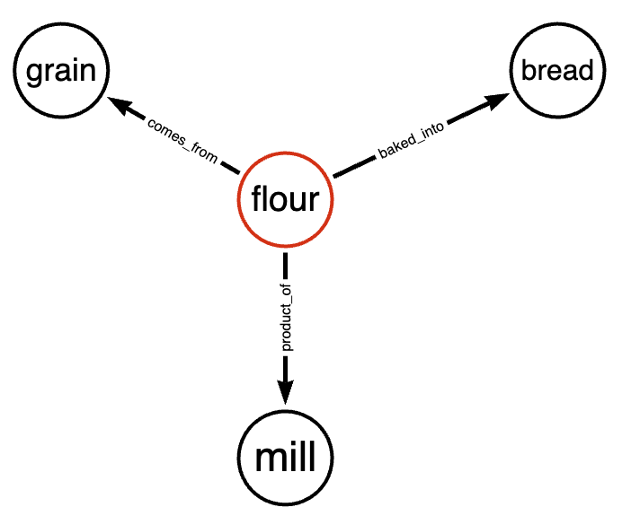

# Unified Biomedical Knowledge Graph (UBKG) 
# Building sets of assertions

---
The Unified Biomedical Knowledge Graph (UBKG) is an organized collection of **assertions**--_relationships_ between things, or _entities_. 

## Entities, Relationships, and Ontologies, and Assertions

### Entities
Because the UBKG is a knowledge graph of biomedical information, its entities will be relevant to biomedical research. Examples include:
- genetic characteristics--structure, variation, methods of interaction
- gene products
- protein characteristics
- diseases
- chemical compounds
- body structures

Many of these entities will be relatively well known, to the extent that they can be identified by codes (**encoded**) in vocabularies (e.g., HGNC ids for genes; transcript IDs in Ensembl). 
Other entities may be the products of new research--e.g., newly identified structures, compounds, or other forms of signal.

### Relationships
Although entities are important in the UBKG, the UBKG's promise is greatest in how it identifies relationships between entities. 
The UBKG can not only summarize a set of relationships in  a particular domain (e.g., relationships between genes and gene products, or 
relationships between gene products and diseases); it may be able to foster the discovery of relationships that span domains (e.g., 
relationships between genes and diseases mediated by gene products).

#### Types of relationships
Relationships in the UBKG are one of two types.

1. **Hierarchical** or _taxonomic_ relationships that characterize entities of the same type. For example, a B cell _is a kind of_ lymphocyte, as is a T cell. The **B cell** and **T cell** entities have a _is a kind of_ hierarchical relationship with **lymphocyte**.
2. **Non-hierarchical** relationships, often between entities of different types. For example, a B cell _produces_ antibodies and a T cell _produces_ cytokines. _produces_ is a non-hierarchical relationship.

###  Ontologies and Assertions

For the purposes of the UBKG, an **ontology** is a collection of relationships that can be identified between the entities of a particular domain of knowledge.
Each relationship in an ontology is part of an **assertion**.

An assertion includes two entities and a relationship. The two entities are usually described as the _subject_ and the _object_. The relationship is expressed as a verb, and is also known as the _predicate_ of the assertion. 

An assertion is thus a statement in the form: **_subject_** _predicate_ **_object_**

An ontology is equivalent to a set of assertions, at least for the purposes of the UBKG. The terms _ontology_ and _set of assertions_ will be used interchangeably.

(Formal definitions of ontologies involve characteristics that are not represented in knowledge graphs.)

### Domains, Namespaces, and SABs
An ontology is a model of a particular state of nature, and is limited to a particular domain. A particular entity may be part of more than one ontology--e.g., genes figure in a number of biomedical ontologies.

The domain for an ontology is also known as its _namespace_. A namespace can also refer to a vocabulary used to encode entities.

Domains are identified with acronymns called **Source Abbreviations** (SABs). Examples of SABs are SNOMEDCT_US, PATO, and UBERON.

####  Example
Consider the following set of assertions from the Phenotypic Quality Ontology (PATO).

(The assertions are represented as they would appear in an [edges.tsv](/formats/#edgestsv) file. 
Predicates have been translated from their labels in Relations Ontology.)

| subject        | predicate         | object         |
|----------------|-------------------|----------------|
| UBERON:0000457 | branching part of | UBERON:0001532 |
| PATO:0001776   | subClassOf        | PATO:0001544   |
| CL:0000101     | capable of | GO:0050906     |   
| PATO:0001894   |subClassOf|UBERON:0000061|

For this set of assertions:
1. The domain is PATO.
2. Entities are from the UBERON, CL, GO, and PATO vocabularies. 

In other words, PATO is the SAB both for the entire ontology and for some entities in the ontololgy.

# Cross-references

As shown in the preceding example, many ontologies use the same identifiers for entities. 
Many entities, however, are represented with different codes in different vocabularies. Identifers from different vocabularies that refer to the same entity are considered _equivalent_.

The UBKG represents equivalent identifiers by means of _cross-reference_ relationships. Cross-referenced entities allow for _synonomy_, or links between vocabularies. 

Synonomy increases the possibility of identifying assertions that span ontological domains. If, for example, ontology A asserts a relationship between two entities and one of the entities is cross-referenced to an entity in another ontology, it may be possible to link the assertion in the first ontology to assertions in the second ontology.

When building a set of assertions, it is important to determine whether any of the entities in assertions can be cross-referenced to other entities. Cross-refrences are listed in the dbxrefs column of the [nodes.tsv](/formats/#nodestsv) file.

# Bringing it all together
To add information to the UBKG, it is necessary to model a domain of information as a set of assertions. 

Modeling includes the following tasks:
1. Identify the ontology domain with an appropriate SAB.
2. Identity the entities in the ontology.
   1. If the entities are encoded in a vocabulary, identify both the codes and the SAB for the vocabulary.
   2. If the entities are not encoded in a vocabulary, define both the SAB and codes.
3. Identify the types of relationships that can exist between entities. Where possible, describe the relationships using properties from the [Relationship Ontology](https://www.ebi.ac.uk/ols/ontologies/ro).
4. Identify applicable cross-references for entities.

The information obtained from these tasks can be used to build the edges and nodes files
that are described on the [Formats](/formats) page.

# Example
You wish to add baking data to the UBKG. You have information on:
- different types of flours 
- grains used to make flours
- mills that grind grains into flours
- breads baked from flours

You have vocabularies by which you identify flours, grains, breads, and mills. For example, GRAIN 001 in your GRAIN vocabulary identifies wheat flour.
You have developed a model that relates elements as follows:

Finally, although you have your own vocabularies, you know that at least some of your data are represented by codes in other vocabularies.
For example, your GRAIN vocabulary includes an entry for "rye", but you know that code 412068007 in SNOMED_CT also refers to rye.

To integrate this data in to the UBKG, you do the following:
1. Define an SAB for your domain--e.g., BAKING. UBKG will assing this SAB to the relationships that you define in your **edges.tsv** file.
2. Organize your codes for grains, breads, flours, and mills. For example,

| Vocabulary | Code | Item        |
|------------|------|-------------|
| FLOUR      | 001  | Wheat flour |
| FLOUR      | 002  | Rye flour   |
| FLOUR      | 003  | Corn flour  |
| GRAIN      | 001  | Wheat       |
| GRAIN      | 002  | Rye         |
| GRAIN      | 003  | Corn        |
| MILL       | 001  | Water mill  |
| MILL       | 002  | Ox mill     |
| MILL       | 003  | Metate      |
| BREAD      | 001  | Sourdough   |
| BREAD      | 002  | Marble rye  |
| BREAD      | 003  | Tortilla    |

 3. Identify suitable relationships from RO, where applicable. For example, 
    - Although your model originally stated that a flour _comes_from_ a grain, you rename the relationship _derives_from_, which corresponds to RO:0001000.
    - You cannot find anything in RO to represent _baked_into_ or _product_of_, so that relationship remains unchanged.
4. Build your **edges.tsv** file, using codes from your vocabularies to represent the entities and the relationships that you defined:

| subject   | predicate  | object    |
|-----------|------------|-----------|
| FLOUR 001 | RO_0001000 | GRAIN 001 |
| FLOUR 001 | product_of | MILL 001  |
| FLOUR 001 | baked_into | BREAD 001 |   
| FLOUR 002 | RO_0001000 | GRAIN 002 |  
| FLOUR 002 | product_of | MILL 001  |
| FLOUR 002 | baked_into | BREAD 002 |
| FLOUR 003 | RO_0001000 | GRAIN 003 |
| FLOUR 003 | product_of | MILL 003  |
| FLOUR 003 | baked_into | BREAD 003 |

5. Build your **nodes.tsv** file, including cross-references for grains that you identified.

| node_id   | node_label  | node_definition       | node_synonyms     | node_dbxrefs          |
|-----------|-------------|-----------------------|-------------------|-----------------------|
| FLOUR 001 | Wheat flour | Flour made from wheat ||
| GRAIN 001 | Wheat       | Wheat                 | Triticum asetivum | SNOMEDCT_US 65256004  |
| MILL 001  | Ox Mill     | Mill driven by oxen   ||
| FLOUR 002 | Rye flour   | Flour made from rye   ||
| GRAIN 002 | Rye         |                       |                   | SNOMEDCT_US 412068007 |