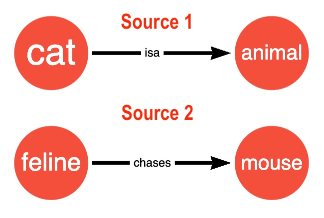
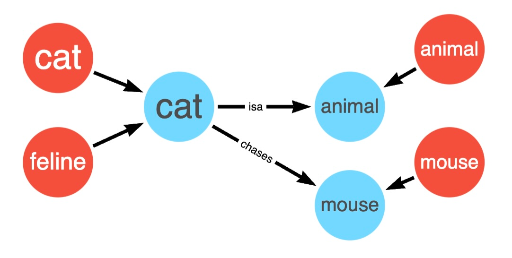
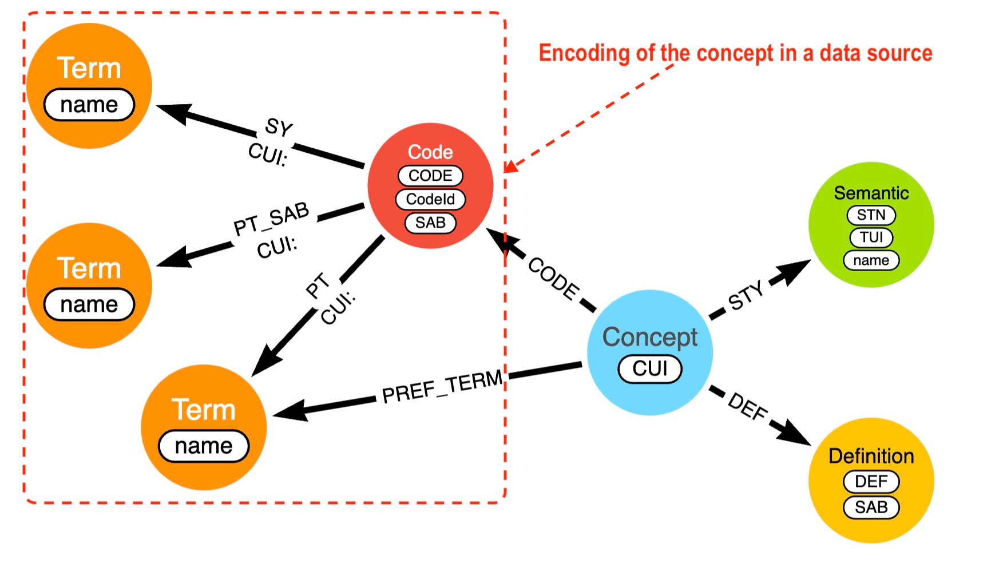
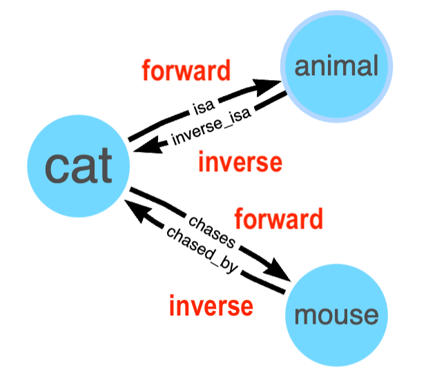

# Unified Biomedical Knowledge Graph (UBKG) 
# Data Model
---
# Purpose of the UBKG
A **Unified Biomedical Knowledge Graph** (UBKG) is a neo4j knowledge 
graph database that combines information from the vocabularies managed by the 
Unified Medical Language System ([UMLS](https://www.nlm.nih.gov/research/umls/index.html)) 
with information from other *data sources*. 

Information from the UMLS includes:
+ A concept model similar to that of the [Metathesaurus](https://www.ncbi.nlm.nih.gov/books/NBK9684/)
+ Semantic types from the [Semantic Network](https://www.ncbi.nlm.nih.gov/books/NBK9679/)

Examples of data sources that are not in the UMLS include:
+ ontology files available from registries such as [OBO Foundry](https://obofoundry.org/
) and [NCBO BioPortal](https://bioportal.bioontology.org/)
+ ontology files available from GitHub repositories
+ exports from public data sources, such as [RefSeq](https://www.ncbi.nlm.nih.gov/refseq/), [UniProt](https://www.uniprot.org/), and [GENCODE](https://www.gencodegenes.org/)
+ custom data sources

The purpose of the UBKG is to organize and to consolidate the _assertions_ that data sources state for biomedical concepts. 

An assertion is a statement of a relationship between two concepts. Examples of assertions include:
+ A cell is a type of another cell.
+ A cell of a certain type is part of a particular organ.
+ A gene is associated with a particular phenotype.

# Concepts and synonymy
Like the UMLS Metathesaurus, the UBKG is structured around _[concepts](https://www.ncbi.nlm.nih.gov/books/NBK9684/#ch02.sec2.3)_. 
A concept is a discrete codification of an idea–e.g., the idea of a _cell_. 

In general, an idea will be represented in more than one data source using codes: for example, the idea of cell is associated with code **4421005** in SNOMEDCT_US and **C12508** in NCI. 

The UBKG establishes _synonymy_ between data sources in the representation of concepts. 
If the code for an entity in one data source can be considered to encode the same entity as a code 
in another data source, then the codes in the different data sources are synonyms. 
Assertions involving the codes that are synonyms can be considered as assertions involving their shared concept. Assertions can thus be consolidated across data sources.

The UBKG extends the UMLS Metathesaurus’s synonymy architecture 
by integrating information from sources outside the UMLS.

## Example
Two data sources assert relationships about cats. 
One source uses the code **cat** to represent the concept _cat_; the other data source uses the code **feline**. 

The data sources assert relationships between their respective codes and other codes.

Because **cat** and **feline** can be considered code synonyms for the concept _cat_, 
it is possible to consolidate assertions from the two sources using concepts instead of codes. 
(The **animal** and **mouse** codes are also associated with concepts; however, these codes are not 
synonyms for a shared concept, and so have separate concept associations.)

The assertions of the two data sources can be consolidated at the concept level. 

+ Before the introduction of concepts, there were two _unconnected_ assertions at the **code** level:
  + **cat** **_isa_** _animal_
  + **feline** **_chases_** _mouse_

+ After the introduction of concepts and synonymy, there are now two _connected_
assertions at the **concept** level:
  + _cat_ **_isa_** _animal_ 
  + _cat_ **_chases_** _mouse_

Because of synonymy, either of the codes **cat** or **feline** can be used as the subject for an assertion. 
The assertion is actually between the associated concepts.

# The concept subgraph
An idea in the UBKG can be considered on two levels of knowledge:
+ _generally_ in terms of a concept (e.g., _cell_)
+ _specifically_ in terms of how the idea is encoded in a particular data source (e.g., code **4421005** in the SNOMEDCT_US vocabulary, which is part of the UMLS content)

The UBKG supports both levels of knowledge by representing each concept with a **concept subgraph** that associates the concept with the synonymous encodings of different data sources.
In other words, a concept subgraph represents both a concept and all the ways that the concept can be represented in the UBKG.

The following image illustrates the general form of a concept subgraph. 
In general, a concept will be encoded in multiple data sources; however, the image illustrates the encoding of a 
concept in a single data source for clarity.

A concept subgraph features both nodes and edges (relationships).

## Nodes (entities) of a concept subgraph
### Concept node
A **Concept** node is the originating node of a concept’s subgraph. 

Each Concept node has a property representing the _Concept Unique Identifier_ (CUI) for the concept.
CUIs for concepts imported from the UMLS are alphanumeric strings starting with “C”–e.g., _C007634_.
If a code from a non-UMLS data source cannot be associated with a UMLS concept, the UBKG generation framework will 
create a Concept node for the code with a CUI that has format _Code in vocabulary_ CUI–e.g., **SNOMEDCT_US:4421005 CUI**.

### Code node
A **Code** node represents the codification of a concept in a data source. For example, the SNOMEDCT_US vocabulary uses 
code **4421005** to represent the concept of _cell_; 
the associated concept has CUI **C007634**. 

Each Code node has the following properties:
+ **SAB** - an identifier for the data source, such as a vocabulary, ontology, or custom source. The acronym SAB is borrowed from the UMLS, and stands for Source ABbreviation. The UMLS defines SABs for the data sources that it contains; the UBKG defines custom SABs for non-UMLS data sources.
+ **CODE** - the code in the data source
+ **CodeId** - the combination of SAB and CODE, formatted as SAB:CODE.

### Term node
A **Term** node represents a term that can be associated with either a code or concept.
Both Code nodes and Concept nodes can have multiple terms associated with them–-
e.g., preferred terms, synonyms, etc.

(_Term_ synonymy is different from the _code_ synonymy for concepts discussed previously.)

The only property of a Term node is **name**.

### Definition node
A **Definition** node represents a definition of a concept. 
Although a source (e.g, a vocabulary) assigns a definition to a code, the UBKG links the Definition node to the 
Concept node associated with the Code node from the source. 

The Definition node has two properties:
+ **DEF** – the definition string
+ **SAB** – the source that provided the definition

## Semantic node
Concepts from the UMLS are associated with Semantic nodes. 
Semantic nodes are translations of the Semantic Network types for concepts.

The Semantic node has three properties:
+ **STN**: the “tree number” identifying the semantic type in the Semantic Network’s [isa hierarchy](https://uts.nlm.nih.gov/uts/umls/semantic-network/root)
+ **TUI**:  the Type Unique Identifier for the semantic type
+ **name**: text of the semantic type

# Relationships in the Concept subgraph
A concept subgraph contains relationships; however, the relationships of a concept 
subgraph are different from relationships that are in assertions 
in that they link concepts with the metadata nodes of type **Code**,
**Term**, **Definition**, and **Semantic**.

In each concept subgraph,
+ The Concept node has:
  + a CODE relationship with one or more Code nodes
  + an optional PREF_TERM relationship with a Term node
  + optional DEF relationships with one or more Definition nodes
  + an optional STY relationship with a Semantic node 
+ The Code node has optional relationships with one or more Term nodes

## Term type relationships
In the UMLS, terms are categorized by _term type_: 
e.g., PT (for preferred term); SY (for synonym); etc. 

The UBKG translates term types into relationships (edges). 
For example, in the UMLS, the preferred term for a code is the term 
with term type **PT**; in the UBKG, the preferred term is the Term node 
that has a relationship of **PT** with the code node.

## PT and PREF_TERM relationships
The preferred term for a Code has a term type of PT. 
The preferred term for a Concept has a term type of PREF_TERM. 
A term can be both the PT for a Code and the PREF_TERM for a Concept.

# Business rules of the concept subgraph
## PT_SAB
A number of non-UMLS sources define relationships between entities in another source–e.g., 
UBERON defines relationships between entities in PATO, CL, etc. 

A source may define a preferred term for a code in another source 
that is different from the preferred term used by the source that 
is the _steward_ of the code: e.g., UBERON might define the 
preferred term for a PATO code as “cells” instead of “cell”.

The UBKG reserves the PT (preferred term) relationship for the 
preferred term for a code defined by the steward of the code: 
e.g., only UBERON can define the preferred term for a UBERON code. 

If a source defines a preferred term for a code from another source and 
either the other source had not been ingested into the UBKG prior to the 
ingestion of the source or the preferred term for the code in the 
source is different than that defined by the other source, 
the UBKG assigns that Term a relationship of PT_SAB, 
where SAB is for the source that is not the steward of the code.

## Preferred Concept
Ideally, each Code node would associate with only one 
Concept node in the UBKG. However, some codes are associated with 
multiple concepts--both in the data exported from the UMLS and 
in non-UMLS sources. 

The UBKG associates each Code with all Concepts that are specified by 
data sources.

However, to mitigate duplicate references, the UBKG attempts to 
find a single preferred concept for each code. 
The UBKG identifies the preferred concept for a code by means of the 
CUI property of the relationships between the Code node and its preferred term node: the CUI property of the Term with relationship PT is the 
CUI of the preferred concept.

# Assertion (Concept-Concept Relationship) model

In the UBKG, the assertions that data sources state between codes 
are represented in the UBKG as relationships between the concepts 
with which codes associate. 

The UBKG represents each assertion that a data source makes 
involving a code with a relationship that involves the Concept node 
of the code’s associated concept subgraph. 
The original code from the data source can be resolved from the 
code’s concept subgraph.

## Inverse assertions and the Relations Ontology (RO)
The UBKG represents each assertion from a data source as a pair of 
bi-directional relationships between two concepts:
+ The _forward relationship_ represents the predicate of the original assertion, between the subject and object.
+ The _inverse relationship_ represents the predicate from the object of the original assertion to the subject.

The UBKG derives inverse assertions when importing from data sources; 
in fact, the edge file from a data source should only contain forward assertions. 

When deriving inverse assertions, the UBKG refers to the [Relations Ontology](https://www.ebi.ac.uk/ols4/ontologies/ro), 
which defines a large number of bidirectional pairs of assertion predicates. 

+ If the term for an assertion matches a relationship in RO, the UBKG will use the relationship’s corresponding inverse to derive the inverse assertion. For example, the inverse relationship for **[has_part](https://www.ebi.ac.uk/ols4/ontologies/ro/properties/http%253A%252F%252Fpurl.obolibrary.org%252Fobo%252FBFO_0000051)** in RO is **part_of**.
+ If the predicate of an assertion cannot be found in RO, the UBKG generates the default inverse assertion by prepending **inverse_** to the forward assertion.

In a previous example, the concept of _cat_ was the subject of two assertions–**_isa_** and **_chases_**. 
The UBKG might represent the bidirectional sets of assertions as follows:

# Properties in the UBKG
Discussions of graph databases often distinguish between 
+ _knowledge graphs_, in which all information is represented as assertions (relationships) between pairs of entities (nodes)
+ _property graphs_, in which information can also be represented as properties on nodes and edges

The UBKG data model combines elements of a knowledge graph with those of a property graph. 
The UBKG is essentially a knowledge graph with a small, constrained set of properties.

## Concept subgraph properties
The majority of the properties in the UBKG support concept subgraphs. These node and edge
properties were discussed previously:

| Element                 | Property | Description                   |
|-------------------------|----------|-------------------------------|
| Concept node            | CUI      | Concept Unique Identifier     |
| Code node               | SAB      | Source ABbreviation           |
|                         | CODE     | Code in the SAB               |
|                         | CodeID   | Concatenation of SAB and CODE |
| Term node               | name     | Text of term                  |
| Definition node         | SAB      | Source ABbreviation           |
|                         | DEF      | Text of definition            |
| Semantic node           | STN      | Semantic Tree Number          |
|                         | TUI      | Type Unique Identifier        |
|                         | name     | Text for semantic type        |
| Code:Term relationships | CUI      | Concept Unique Identifier     |

###  Node properties

The UBKG generation framework allows data sources to define the following properties 
for a node in the node file:
+ **value**
+ **lowerbound**
+ **upperbound**
+ **unit**

### Edge properties
The UBKG generation framework allows data sources to define a property named **evidence_class** for an assertion in the edge file.

