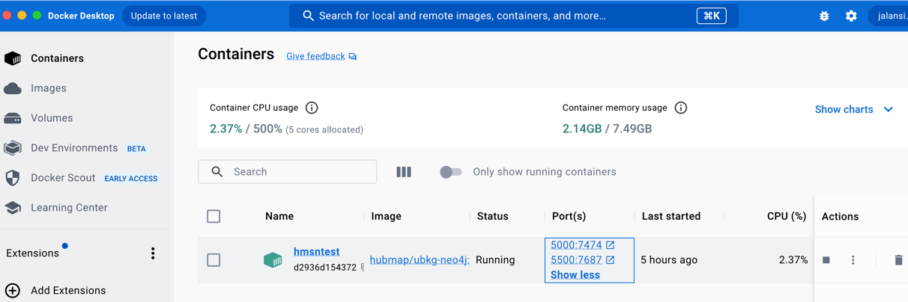
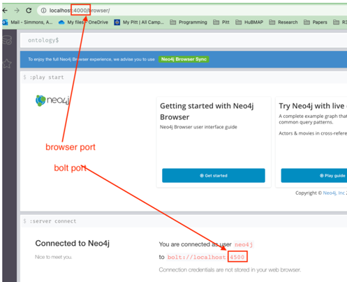

# Unified Biomedical Knowledge Graph (UBKG) 
# Docker Distribution

The UBKG is available in a Docker container deployment that can 
be installed and run on a local machine. The Docker container
includes its own version of a neo4j database server.

# Licensing
The UBKG Docker distribution includes a set of UBKG ontology CSV files.
UBKG ontology CSV files contain licensed content extracted from the Unified Medical Language System ([UMLS](https://www.nlm.nih.gov/research/umls/index.html)).
The ontology CSV files cannot be published to public repositories, such as Github or Dockerhub. 
The distribution requires authorization because of licensing issues.

To obtain the UBKG Docker distribution, contact the UBKG steward:

   [Jonathan Silverstein, MD](mailto:j.c.s@pitt.edu)

    Jonathan Silverstein, MD
    Department of Biomedical Informatics
    University of Pittsburgh

# Prerequisites
1. [Docker must be installed](https://docs.docker.com/engine/install/) on the local machine with Docker BuildX build support.  
By default Docker BuildX support is installed with Docker Desktop.  If you have a version of Docker installed without Desktop you can [install Docker BuildX manually](https://docs.docker.com/build/install-buildx/).
2. The bash shell scripts contained in this directory are intended for use on Mac OS X or Linux. These scripts will not work on Windows. (The resulting Docker images will, however, run on Windows.)

# Simple Installation

(For more custom installations, consult the readme in the [ubkg-neo4j GitHub repo](https://github.com/x-atlas-consortia/ubkg-neo4j).)

1. Obtain a UBKG Distribution from the UBKG steward. The distribution will be a Zip archive. 
2. Unzip the archive on the local machine.
3. Start Docker Desktop.
4. Start a Terminal session.
5. Move to the root folder of the expanded archive.
6. Execute the `run.sh` script, with parameters described below.
   
   The only required parameter is **-p**, which sets the password that you will use to connect to the UBKG instance. The other parameters are optional, and have default values. See the note on alternative port mappings.

| Parameter | required | Description                                                                         | Default      |
|-----------|----------|-------------------------------------------------------------------------------------|--------------|
| -p         | **yes**  | password for the neo4j account                                                      |              |
| -n         | no       | the port to expose the **neo4j browser/UI** on                                      | 7474         |
| -b         | no       | the port to expose the **neo4j/bolt://** interface on                               | 7687         |

6. The **run.sh** script will require around 10 minutes to complete. The script will:
   - create a new Docker container hosting an instance of neo4j
   - populate the neo4j instance in the Docker container with UBKG content (from files in the Zip archive)
7. The final output of the script in the Terminal window will be a statement ending with a time stamp and **INFO Started**--e.g.,
`2023-07-27 19:43:28.425+0000 INFO  Started.` This statement means that the UBKG instance is ready. 
8. You can close the Terminal session at this point.

###  Alternative port mappings with the -n and -b parameters
By default neo4j instances use 7474 for the browser port and 7687 for the bolt port. 
If the local machine is running its own instance of neo4j, use the **-n** and
**-b** parameters to direct the UBKG Docker instance to use different ports. 

# Connect

1. In a browser window, connect to the UBKG instance locally using http://localhost:_port_.
   * If you specified a value for _port_ in **run.sh** with the **-n** option, use that port. 
   * If you did not specify a value for _port_, use the default of 7474. 
2. The **Connect to Neo4j** screen will appear. In the **Connect URL** box,
   * Change the option to **bolt://**.
   * If you specified the bolt port in **run.sh** using the **-b** option, change the port; otherwise, use the default of 7687. 
3. Fill in the **Username** (neo4j)
4. Fill in the **Password** that you specified with the **-p** option with **run.sh**.
5. Click **Connect**.

# Starting and stopping
If you restart the machine, simply restart the Docker container in Docker Desktop

### Example

The following screen capture is from a browser pointing to a UBKG instance created with the command
`./run.sh -p test -n 4000 -b 4500`

