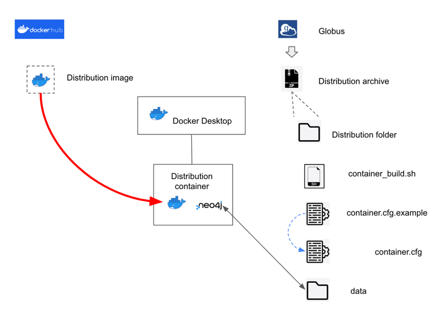
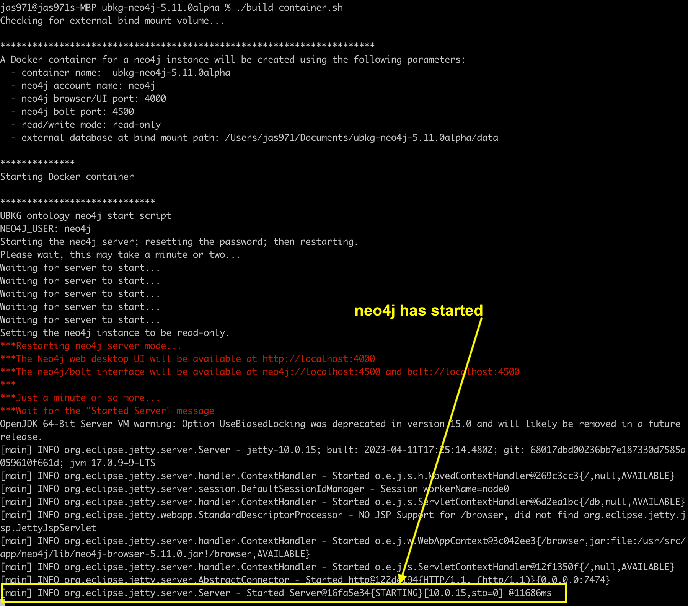
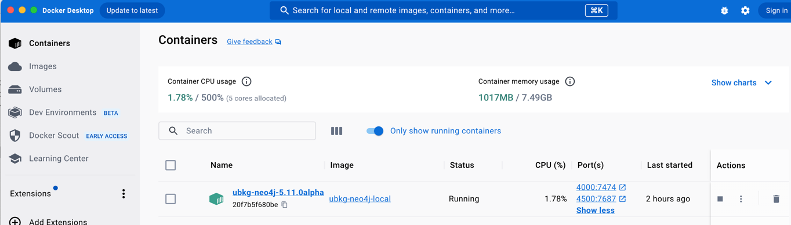
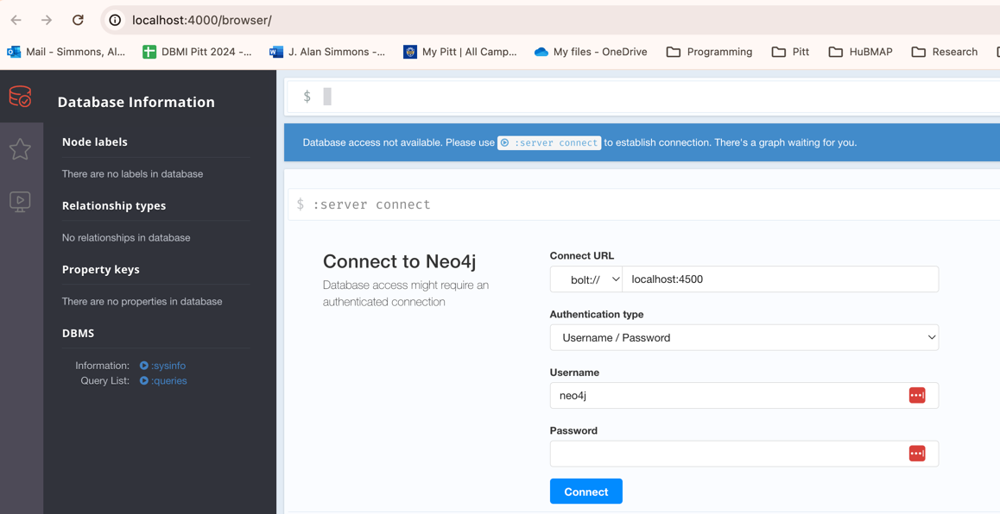

# Unified Biomedical Knowledge Graph (UBKG) 

# Obtaining and deploying UBKG content

Content related to the UBKG is available at the [UBKG download site](https://ubkg-downloads.xconsortia.org/). 
With the exception of Petagraph, files on the donwload site are available as
Zip archives.

## Types of UBKG content

### Turnkey neo4j distributions

These Zip files expand to files that deploy fully-indexed, standalone UBKG instances 
as neo4j graph databases, running in a Docker container. 

Installation of a turnkey neo4j distribution is minimal--in particular, it does not require separate installation of neo4j locally. 
The host machine only needs to have Docker installed.

### Ontology CSV files

These Zip files expand to the set of twelve ontology CSV files that can be imported into a neo4j instance, such as a 
local ("bare metal") deployment on a machine. Importing and indexing of this content in a neo4j instance would involve 
executing scripts in the [ubkg-neo4j](https://github.com/x-atlas-consortia/ubkg-neo4j) repository.

### Petagraph
The Petagraph dump file is a neo4j database dump of the Petagraph neo4j database, described in [Stear et al](https://www.nature.com/articles/s41597-024-04070-w).

# Downloading from the UBKG Download site

### UMLS API requirements

A UBKG instance includes content from the Unified Medical Language System ([UMLS](https://www.nlm.nih.gov/research/umls/index.html)), 
a repository of biomedical vocabularies maintained by the National Library of Medicine. 
The use of content from the UMLS is governed by the [UMLS License Agreement](https://uts.nlm.nih.gov/uts/assets/LicenseAgreement.pdf).

Use of the UMLS content in the UBKG requires two licenses:

- The University of Pittsburgh distributes content originating from the UMLS by means of a distributor license.
- Consumers of the UBKG have access to UMLS content through the license that is part of their [UMLS Technology Services (UTS)](https://documentation.uts.nlm.nih.gov/rest/authentication.html) accounts.

The UBKG download site combines the API key from the University of Pittsburgh with the API key from a user to authenticate a user's request to download the UBKG. 
The user must provide the API for their UTS account to the UBKG Download site.

To obtain a UTS API key:
- Create a UTS user profile.
- Generate an API key.

# Turnkey distribution

## Host configuration
1. Install [Docker](https://docs.docker.com/engine/install/) on the host machine.
2. The host machine will require considerable disk space to accommodate the unzipped distribution, depending on the distribution. As of December 2023, distribution sizes were around:
   - base context: 9GB
   - HuBMAP/SenNet: 9GB
   - Data Distillery: 20GB

## Simple Deployment
This deployment uses default settings. 
These instructions assume that the operating system for the host machine 
is either Linux or MacOs. 



1. Expand the Zip archive. The expanded distribution directory will contain:
   - a directory named **Data**. This directory contains the UBKG neo4j database files.
   - a script named **build_container.sh**. This script builds a Docker container hosting the UBKG instance of neo4j.
   - **container.cfg.example**. This is an annotated example of the configuration file required by **build_container.sh**.
2. The distribution scripts require a file named **container.cfg**. Create your own version of a **container.cfg** file by copy **container.cfg.example** to a file named **container.cfg**. 
   - The **container.cfg.example** file assigns default configuration values to the distribution, including the password for the _neo4j_ user account. 
   - It is recommended that you change the password for the _neo4j_ user account in **container.cfg**. 
   - Passwords must have at least 8 letters and have at least one alphabetic and one numeric character.
4. Start Docker Desktop. 
5. Open a Terminal session.
6. Move to the distribution directory (where the Zip was expanded).
7. Execute `./build_container.sh`.
8. The **build_container.sh** will run for a short time (1-2 minutes), and will be finished when it displays a message similar to ```[main] INFO org.eclipse.jetty.server.Server - Started Server@16fa5e34{STARTING}[10.0.15,sto=0] @11686ms```



The **build_container.sh** will create a Docker container with properties that it obtains from **container.cfg**. 
Following are the default properties:

| Property       | Value                   |
|----------------|-------------------------|
| container name | ubkg-neo4j-<*version*>  |
| image name     | hubmap/ubkg-neo4j       |
| image tag      | current-release         |
| ports          | 4000:7474<br/>4500:7687 |
| read-write     | read-only               |



8. Open a browser window. Enter `http://localhost:<port>/browser/`, where <port> is the neo4j port specified in the configuration. The default value from **container.cfg**  is **4000**.
9. The neo4j browser window will appear. Enter connection information:

| Property            | Value                                                                                                                                                                 |
|---------------------|-----------------------------------------------------------------------------------------------------------------------------------------------------------------------|
| Connect URL         | bolt://localhost:<bolt port>. This should load by default, with <bolt port> equal to the port specified in the **container.cfg** file. The default value is **4500**. |
| Database name       | blank (the default). Note that this field may not appear on the page.                                                                                                 |
| Authentication Type | Username/Password                                                                                                                                                     |
| Username            | neo4j                                                                                                                                                                 |
| Password            | password from **container.cfg**                                                                                                                                       |


10. Select **Connect**. 
11. You should be able to start running Cypher commands in the neo4j browser.

## Custom Deployment
### Changes to Docker configuration
To modify the Docker configuration, change values in the **container.cfg** file.
Keeping the value commented results in the script using a default value.

| Value          | Purpose                                                   | Recommendation                                                                         |
|----------------|-----------------------------------------------------------|----------------------------------------------------------------------------------------|
| container_name | Name of the Docker container                              | accept default                                                                         |
| docker_tag     | Tag for the Docker container                              | accept default                                                                         |
| neo4j_password | Password for the neo4j user                               | minimum of 8 characters, including at least one letter and one number                  |
| ui_port        | Port used by the neo4j browser                            | number other than 7474 to prevent possible conflicts with local installations of neo4j |
| bolt_port      | Port used by neo4j bolt (Cypher)                          | number other than 7687 to prevent possible conflicts with local installations of neo4j |
| read_mode      | Whether the neo4j database is *read-only* or *read-write* | accept default (read-only)                                                             |
| db_mount_dir   | Path to the external neo4j database                       | accept default (/data)                                                                 |
| all others     | Not used for deployment; values will be ignored           | accept default                                                                         |

### Rename configuration file
To specify another configuration file, execute the command ```/.build_container.sh external -c <your configuration file>```