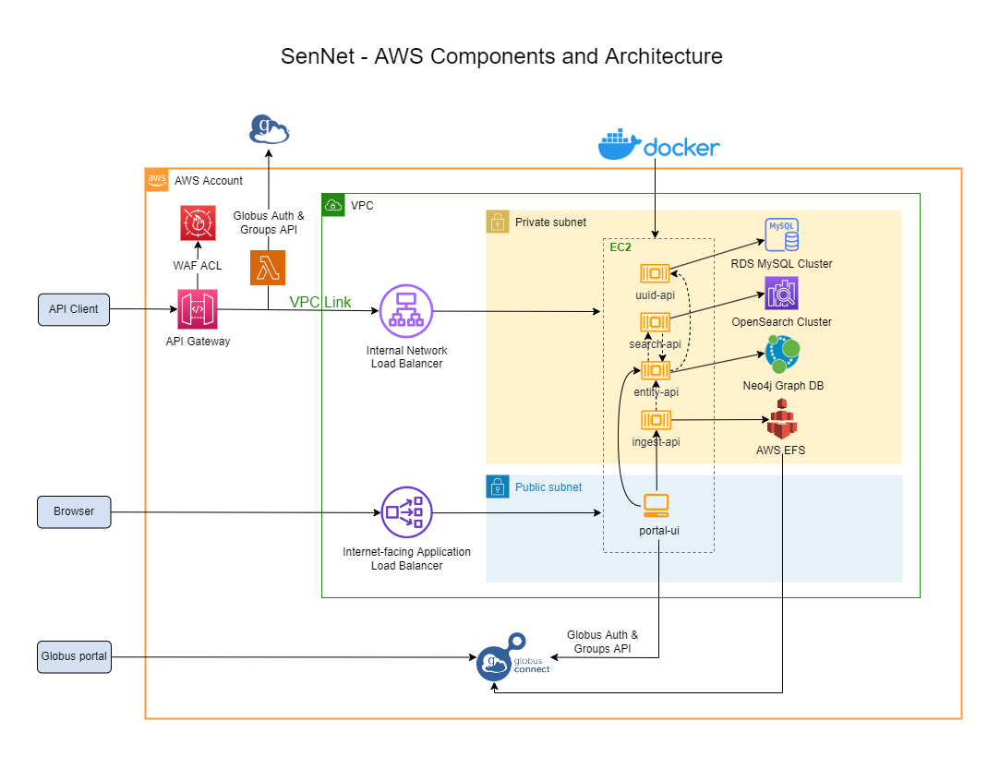

# SenNet Software Documentation

SenNet offers several software and tool components for programmatic access to SenNet data and metadata.  This site contains information about this software and tools, more information is available at the [SenNet Consortium Site](https://sennetconsortium.org/) or the [SenNet Data Portal](https://data.sennetconsortium.org)

## [APIs](/apis)
There are several APIs which can be used to search and retrieve information about SenNet data.  All are linked below in the architecture diagram and on the [API Index](/apis).

## SDK
The [SenNet SDK](/sdk) is a Python library to interface with the [Entity API](https://smart-api.info/ui/0065e419668f3336a40d1f5ab89c6ba3).

## Libraries
### [Provenance UI](/libraries/provenance-ui)
- [GitHub Repo](https://github.com/sennetconsortium/provenance-ui/tree/main/src)  
- [Docs](/libraries/provenance-ui)